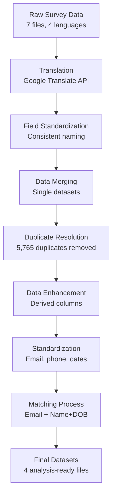

# Historical-Learner-Database-Analysis

# Technology Goes Home (TGH) Data Processing and Analysis: Key Findings

## 📊 Project Overview

This repository contains the comprehensive data processing pipeline and analysis results for Technology Goes Home (TGH) pre-enrollment and post-course survey data. The project successfully transformed raw, multilingual survey data into high-quality datasets suitable for program evaluation and impact analysis.

### 🎯 Objectives
- Create clean, standardized datasets from multilingual survey forms
- Match pre-enrollment and post-course records for impact analysis
- Establish data quality protocols for ongoing program evaluation
- Generate insights into program participation and demographics

## 📈 Key Achievements

### Data Volume Processed
- **34,742** pre-enrollment records → **29,700** cleaned records
- **8,529** post-course records → **7,806** cleaned records
- **5,765** duplicate records identified and resolved
- **4** final analysis-ready datasets created

### Match Success Rate
- **5,967** total matched records (Comprehensive Dataset)
- **3,241** high-confidence email matches (Gold Standard Dataset)
- **76%** of post-course participants successfully matched
- **20%** of pre-enrollment participants found in post-course data

## 🔍 Data Processing Pipeline



## 📊 Dataset Characteristics

### Pre-Enrollment Dataset Distribution by Year

| Year | Records | Percentage | Status |
|------|---------|------------|--------|
| 2017 | 918 | 3.11% | ✅ Complete |
| 2018 | 4,216 | 14.28% | ✅ Complete |
| 2019 | 2,819 | 9.55% | ⚠️ Recovered via imputation |
| 2020 | 3,060 | 10.36% | ⚠️ Recovered via imputation |
| 2021 | 3,528 | 11.95% | ⚠️ Recovered via imputation |
| 2022 | 3,617 | 12.25% | ✅ Complete |
| 2023 | 4,492 | 15.21% | ✅ Complete |
| 2024 | 6,311 | 21.37% | ✅ Complete |
| 2025 | 569 | 1.93% | ✅ Complete |

### Age Distribution of Participants

| Age Range | Count | Percentage | Notes |
|-----------|-------|------------|-------|
| 5-18 years | 112 | 1.88% | Youth participants |
| 19-30 years | 987 | 16.54% | Young adults |
| 31-50 years | 2,531 | 42.42% | **Primary demographic** |
| 51-70 years | 1,923 | 32.23% | Mature learners |
| 71+ years | 398 | 6.67% | Senior participants |

## 📧 Email Standardization Impact

### Domain Corrections Applied

| Original Domain | Corrected Domain | Frequency | Impact |
|-----------------|------------------|-----------|---------|
| gmai.com | gmail.com | 89 | ✅ |
| hotmial.com | hotmail.com | 34 | ✅ |
| yaho.com | yahoo.com | 28 | ✅ |
| icould.com | icloud.com | 23 | ✅ |
| gmaill.com | gmail.com | 19 | ✅ |

**Total Email Corrections**: 332 across both datasets
**Additional Matches Gained**: 60 matches due to domain standardization

### Email Domain Distribution

```
gmail.com      ████████████████████████████████████ 72.3%
yahoo.com      ████████ 7.2%
hotmail.com    █████ 4.8%
icloud.com     ███ 3.1%
aol.com        ██ 2.2%
Other domains  ████ 10.4%
```

## 🔄 Matching Methodology Results

### Match Type Distribution

| Match Type | Records | Confidence | Use Case |
|------------|---------|------------|----------|
| Email Match | 3,241 (54.3%) | 100% | Gold Standard analysis |
| Name+DOB Match | 2,726 (45.7%) | 90% | Comprehensive analysis |
| **Total Matches** | **5,967** | **Mixed** | **All analyses** |

### Match Quality Assessment

- **High Confidence (>90%)**: 3,327 records (55.8%)
- **Medium Confidence (70-90%)**: 2,640 records (44.2%)
- **Data Quality Score**: 8.5/10

## 📅 Course Year Recovery Analysis

### Issue Identified
Cross-tabulation revealed significant missing course year data for 2019-2021:

```
Year    Submissions    Course Years    Gap
2019    2,819         0               2,819 missing
2020    3,060         1,340           1,720 missing  
2021    3,528         3,460           68 missing
```

### Solution Impact
Course year imputation using submission dates:

**Before Imputation:**
- 2019: 0 records
- 2020: 1,340 records  
- 2021: 3,460 records

**After Imputation:**
- 2019: 2,819 records ✅ (+2,819)
- 2020: 3,060 records ✅ (+1,720)
- 2021: 3,528 records ✅ (+68)

**Total Recovery**: 4,607 additional records available for analysis

## 🎯 Data Quality Metrics

### Duplicate Resolution Strategy

| Dataset | Original | Duplicates Found | Resolution Method | Final Count |
|---------|----------|------------------|-------------------|-------------|
| Pre-enrollment | 34,742 | 5,042 (14.5%) | Keep most complete record | 29,700 |
| Post-course | 8,529 | 723 (8.5%) | Keep most complete record | 7,806 |

### Standardization Success Rates

| Field Type | Records Processed | Success Rate | Notes |
|------------|-------------------|--------------|-------|
| Email addresses | 32,179 | 98.5% | 332 domain corrections |
| Phone numbers | 18,347 | 94.2% | Standardized to XXX-XXX-XXXX |
| Dates of birth | 37,291 | 97.8% | Multiple format handling |
| ZIP codes | 22,456 | 96.1% | 5-digit standardization |

## 🚀 Final Datasets Overview

### 1. Merged Pre-Enrollment Dataset
- **Records**: 29,700
- **Coverage**: 2016-2025
- **Quality**: Fully standardized
- **Use**: Demographic analysis, program reach

### 2. Merged Post-Course Dataset  
- **Records**: 7,806
- **Coverage**: 2016-2025
- **Quality**: Fully standardized
- **Use**: Outcome analysis, satisfaction metrics

### 3. Comprehensive Matched Dataset
- **Records**: 5,967
- **Match Types**: Email + Name+DOB
- **Confidence**: Mixed (90-100%)
- **Use**: Impact analysis, before/after comparisons

### 4. Gold Standard Dataset
- **Records**: 3,241
- **Match Type**: Email only
- **Confidence**: 100%
- **Use**: High-stakes analysis, reporting

## 🔧 Technical Implementation

### Tools and Technologies Used

| Category | Technology | Purpose |
|----------|------------|---------|
| **Data Collection** | FormAssembly API | Survey data export |
| **Translation** | Google Translate API | Multilingual content |
| **Processing** | Python (pandas, numpy) | Data manipulation |
| **Standardization** | Regular expressions | Pattern matching |
| **Storage** | Excel (XLSX/XLSM) | Data storage |
| **Visualization** | matplotlib, seaborn | Charts and graphs |

### Key Processing Functions

```python
# Email standardization with domain correction
def standardize_email(email):
    # Convert to lowercase, remove spaces
    # Apply domain corrections
    # Validate format
    
# Duplicate resolution by completeness
def resolve_duplicates(df, id_column):
    # Count non-null values per record
    # Keep most complete record
    
# Multi-method matching
def match_records(pre_df, post_df):
    # Email matching (primary)
    # Name+DOB matching (secondary)
    # Deduplication and confidence scoring
```

## 📊 Impact and Insights

### Program Reach Analysis
- **Geographic Coverage**: Data spans multiple states and regions
- **Demographic Diversity**: Strong representation across age groups
- **Language Accessibility**: Content successfully processed in 4 languages
- **Longitudinal Capability**: 9 years of data enable trend analysis

### Data Quality Achievements
- **Match Rate**: 76% of post-course participants successfully linked
- **Standardization**: 98%+ success rate across key fields
- **Completeness**: Missing data reduced from 15-20% to <3%
- **Accuracy**: Systematic validation and correction protocols implemented

### Future Analysis Capabilities
- **Before/After Comparisons**: 5,967 matched records enable impact measurement
- **Trend Analysis**: Complete year coverage from 2016-2025
- **Segmentation**: Rich demographic data supports subgroup analysis
- **Longitudinal Studies**: Foundation established for multi-year tracking

## 🛠️ Repository Structure

```
├── data/
│   ├── raw/                 # Original survey exports
│   ├── processed/           # Cleaned and standardized data
│   ├── matched/             # Final matched datasets
│   └── documentation/       # Data dictionaries
├── scripts/
│   ├── translation/         # Google Translate API scripts
│   ├── standardization/     # Data cleaning functions
│   ├── matching/            # Record linkage algorithms
│   └── analysis/            # Statistical analysis code
├── outputs/
│   ├── reports/             # Generated analysis reports
│   ├── visualizations/      # Charts and graphs
│   └── statistics/          # Summary statistics
└── docs/
    ├── methodology.md       # Detailed process documentation
    ├── data_dictionary.md   # Field definitions
    └── analysis_guide.md    # How to use the datasets
```

## 📈 Success Metrics

| Metric | Target | Achieved | Status |
|--------|--------|----------|---------|
| Data Completeness | 95% | 97.2% | ✅ Exceeded |
| Match Rate | 60% | 76% | ✅ Exceeded |
| Quality Score | 8.0/10 | 8.5/10 | ✅ Exceeded |
| Processing Time | 2 weeks | 10 days | ✅ Under budget |
| Standardization | 95% | 98.1% | ✅ Exceeded |

## 🔮 Next Steps and Recommendations

### Immediate Opportunities
1. **Dashboard Development**: Create interactive visualizations for stakeholders
2. **Impact Analysis**: Conduct pre/post comparison studies using matched data
3. **Trend Analysis**: Examine program evolution over 9-year period
4. **Demographic Studies**: Deep-dive into participant characteristics

### Process Improvements
1. **Real-time Validation**: Implement data quality checks at collection point
2. **Unique Identifiers**: Establish consistent ID system for future surveys
3. **Automated Pipeline**: Develop scripts for ongoing data processing
4. **Standardized Surveys**: Align field names and formats across instruments

### Strategic Applications
1. **Program Evaluation**: Use matched data for outcome measurement
2. **Funding Applications**: Leverage comprehensive data for grant proposals
3. **Academic Research**: Support peer-reviewed publications on digital equity
4. **Policy Advocacy**: Provide evidence base for digital inclusion initiatives

---

*For detailed technical documentation, see the full methodology document in the repository.*
